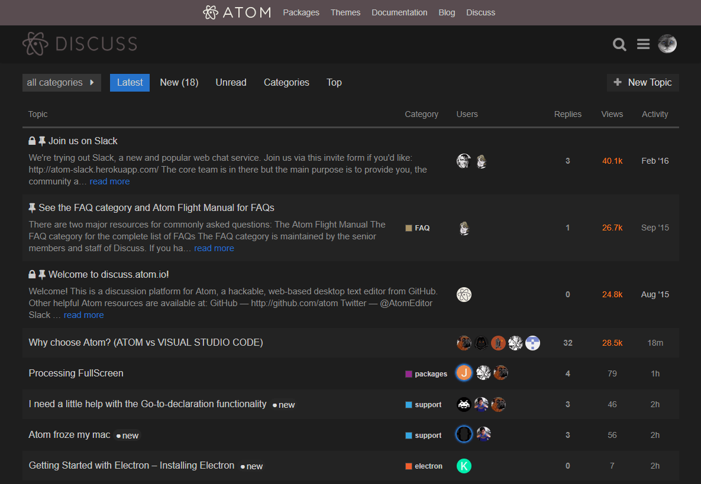

  
   
  
  
  
  

* This dark theme applies to the following discourse-styled forums:
  * https://discourse.mozilla.org/
  * https://discourse.wicg.io/
  * https://discuss.atom.io/
  * https://discuss.codemirror.net
  * https://forum.freecodecamp.org/
  * https://www.sitepoint.com/community/
  * https://meta.discourse.org/
  * https://platform.github.community/
  * https://talk.commonmark.org/
  * https://twittercommunity.com/
  * Let us know if we need to add more.

## Preview

## Installing

* If you're using a browser extension:
  * Stylus - get the addon for [Firefox](https://addons.mozilla.org/en-US/firefox/addon/styl-us/), [Chrome](https://chrome.google.com/webstore/detail/stylus/clngdbkpkpeebahjckkjfobafhncgmne) and [Opera](https://addons.opera.com/en-gb/extensions/details/stylus/).
  * Stylish - get the addon for [Firefox](https://addons.mozilla.org/en-US/firefox/addon/2108/), [Chrome](https://chrome.google.com/extensions/detail/fjnbnpbmkenffdnngjfgmeleoegfcffe), [Opera](https://addons.opera.com/en/extensions/details/stylish/), [Safari](http://sobolev.us/stylish/) and [Firefox Mobile](https://addons.mozilla.org/en-US/firefox/addon/2108/).
  * FreeStyler is available for [Chrome](https://chrome.google.com/webstore/detail/freestyler/hihigldmabkodfpehkgdemjklmaebmca). 
  * Then install this style using:
    * [userstyles.org](https://userstyles.org/styles/154032/discourse-dark) (with customization options)
    * or, add it [manually](https://github.com/StylishThemes/Discourse-Dark/blob/master/discourse-dark.user.css) into the editor.
* Or, **[install directly](https://github.com/StylishThemes/Discourse-Dark/raw/master/discourse-dark.user.css)** from this repository by opening the user.css file; only available using Stylus or FreeStyler (see the [documentation](https://github.com/openstyles/stylus/wiki/Usercss)). :tada:

## Updating

If a recent change broke the style, chances are that we already fixed it. Make sure to reinstall from [userstyles.org](https://userstyles.org/styles/154032/discourse-dark) or [GitHub](https://github.com/StylishThemes/Discourse-Dark/raw/master/discourse-dark.user.css) before opening an issue.

## Contributions

If you would like to contribute to this repository, please...

1. Fork
2. Make changes (please read the [contribution guidelines](./.github/CONTRIBUTING.md) and abide by them)
3. Create a pull request!
