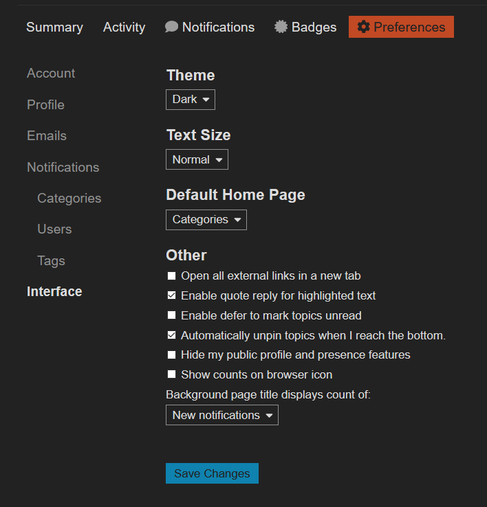

<h3 align="center">:warning: NOTICE This project is currently not maintained,
  <a href="https://github.com/StylishThemes/Discourse-Dark/issues/42">looking for contributors</a>
</h3>

  
   
  
  
  
  

* See the [known list](https://github.com/StylishThemes/Discourse-Dark/wiki) of websites where this dark theme works. Let us know if we need to add more.

## Preview

## Installation

A userstyle extension is required, common ones include:

🎨 Stylus for [Firefox](https://addons.mozilla.org/en-US/firefox/addon/styl-us/), [Chrome](https://chrome.google.com/webstore/detail/stylus/clngdbkpkpeebahjckkjfobafhncgmne) or [Opera](https://addons.opera.com/en-gb/extensions/details/stylus/). 
🎨 xStyle for [Firefox](https://addons.mozilla.org/firefox/addon/xstyle/) or [Chrome](https://chrome.google.com/webstore/detail/xstyle/hncgkmhphmncjohllpoleelnibpmccpj).

Then:

📦 [Install the usercss](https://github.com/StylishThemes/Discourse-Dark/raw/master/discourse-dark.user.css) with Stylus or xStyle. Supports automatic updates.

## Using Discourse type built in dark themes

Many of the sites supported, have for a while been able to swich to dark versions, this is a per site setting.
By no means there is a list of said sites, if you're wondering if a site you visit supports it, continue reading.

In order to use default dark sites do:

1. Goto  **Preferences** > Interface
1. Under Themes select Dark
1. Press [ Save Changes ]

You should see 💥

> 💥 Note design shown on screenshot may vary on some sites.

We do not suport bug issues to this style while using the native dark style,
You should not enable this style, while using the built in dark themes.

## Contributions

1. 👓 Read the [contribution guidelines](./CONTRIBUTING.md).
1.  [Fork](https://github.com/StylishThemes/Discourse-Dark/fork) or  [download](https://github.com/StylishThemes/Discourse-Dark/archive/master.zip) this repository.
1. 👌 Create a pull request!

Thanks to all that have [contributed](./AUTHORS) so far!
